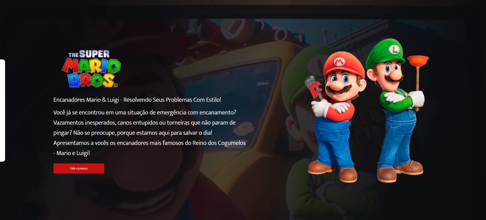

<h1>
Projeto Super Mario
</h1>

<h2>
📕 Sobre o projeto 
</h2>

Esse projeto foi desenvolvido durante as aulas do DevClub. O conteúdo do site foi feito em HTML e CSS e utilizamos Javascript para fazer o efeito de movimentação do formulário.

<h2>
🔨 Ferramentas
</h2> 

<ul>
<li>HTML</li>
<li>CSS</li>
<li>Javascript</li>
</ul>

